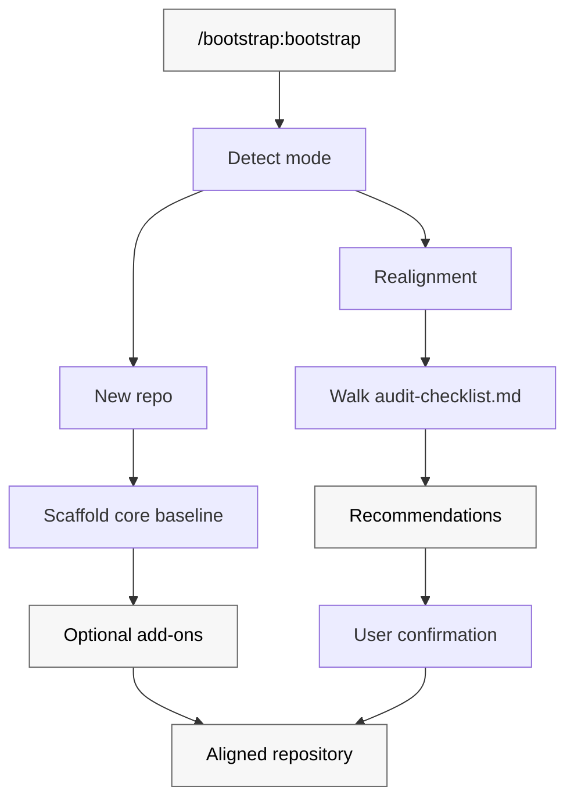

# Bootstrap

Scaffold a new repository — or realign an existing one — to the Patina Project baseline. One invocation, consistent conventions, portable across every major AI coding tool.

Bootstrap is a Claude Code + Codex plugin distributed through the [`patinaproject/skills`](https://github.com/patinaproject/skills) marketplace. It ships a single skill that scaffolds a complete Patina-baseline repository (commit + PR conventions, PNPM + Husky + markdownlint, agent docs, plugin manifests, release flow, GitHub repo settings) and keeps existing repos aligned with the latest baseline on rerun.

## How bootstrap works

Bootstrap operates in one of two modes based on what it finds in the target repository.



## What bootstrap enforces

### Core baseline — every repo

- **Conventional Commits** with no scope and a required `#<issue>` tag; enforced locally by husky + commitlint and in CI by `lint-pr.yml`.
- **PR title hygiene** — ASCII-only, conventional format, `#<issue>` subject, breaking-change marker consistency, `Closes #<issue>` in body.
- **Markdown linting** via `markdownlint-cli2`; husky `pre-commit` + `lint-staged` locally, `lint-md.yml` in CI.
- **Workflow linting** via `actionlint` with `.github/actionlint.yaml`.
- **GitHub Actions SHA pinning** — every `uses:` references a full commit SHA with a version comment; policy documented in `AGENTS.md`.
- **PNPM toolchain** — `packageManager: pnpm@10.33.2`, `engines.node >=24`, `.nvmrc`, `.gitattributes`, `.editorconfig`.
- **Agent + repo docs** — `AGENTS.md`, `CLAUDE.md`, `CONTRIBUTING.md`, `SECURITY.md` (public only), `README.md`, `docs/file-structure.md`.
- **Claude Code project settings** — `.claude/settings.json` with `enabledPlugins` declaring Patina marketplace plugins.
- **CODEOWNERS + issue/PR templates** under `.github/`.

### AI agent plugin add-ons

When the repo is itself a plugin, bootstrap additionally emits manifests/config for every AI coding tool with a real plugin/extension model: Claude Code, Codex, GitHub Copilot, Cursor, Windsurf. Aider, Zed, Cline, Codex CLI, and Opencode are covered by the core `AGENTS.md`. Continue.dev is an opt-in secondary editor.

### Release flow

For plugins, bootstrap wires a complete [release-please](https://github.com/googleapis/release-please) flow — standing release PR, auto-generated `CHANGELOG.md` and GitHub Release notes, both plugin manifests kept in lockstep with `package.json` on every bump. When the repo is in the `patinaproject` org, the release workflow also dispatches a marketplace-bump event to `patinaproject/skills`.

### GitHub repository settings

Bootstrap walks the target repo's merge settings (via `gh api`, `curl`, or visual inspection) and walks the user through the GitHub UI with a deep-link to bring them into alignment. Full matrix in [SKILL.md](./skills/bootstrap/SKILL.md#github-repository-settings).

## Modes

- **New repo** — scaffold the full baseline, leave the first commit to the user.
- **Realignment** — walk the checklist, classify gaps as `missing`/`stale`/`divergent`, recommend changes grouped into ordered batches, never overwrite without explicit user confirmation.

## Supported AI coding tools

| Tool | Surface | Covered by |
|---|---|---|
| Claude Code | `.claude-plugin/plugin.json` | Plugin manifest |
| Codex (CLI + App) | `.codex-plugin/plugin.json` | Plugin manifest |
| GitHub Copilot | `.github/copilot-instructions.md` | Instructions file |
| Cursor | `.cursor/rules/<repo>.mdc` | Rule file |
| Windsurf | `.windsurfrules` | Rule file |
| Aider, Zed, Cline, Codex CLI, Opencode | — | `AGENTS.md` (native) |
| Continue.dev | `.continue/config.json` | Opt-in |

## Installation

### Claude Code

1. Register the Patina marketplace:

   ```text
   /plugin marketplace add patinaproject/skills
   ```

2. Install Bootstrap:

   ```text
   /plugin install bootstrap@patinaproject
   ```

3. Open the target repo in Claude Code (or a GitHub issue in the target repo) and invoke:

   ```text
   /bootstrap:bootstrap
   ```

### OpenAI Codex CLI

1. Register the Patina marketplace:

   ```bash
   codex plugin marketplace add patinaproject/skills
   ```

2. Install the plugin pinned to a tag (recommended):

   ```bash
   codex plugin marketplace add patinaproject/bootstrap@v0.1.0
   ```

3. Open the target repo and invoke:

   ```text
   Use $bootstrap to scaffold or realign this repository.
   ```

### OpenAI Codex App

1. Install or enable the Bootstrap plugin from your Codex plugin source.
2. Open the target repo in the app.
3. Invoke:

   ```text
   Use $bootstrap to scaffold or realign this repository.
   ```

## First use

After installing, run bootstrap from a cloned repository. The skill will prompt for:

- `<owner>`, `<repo>`, `<repo-description>`
- `<visibility>` — public or private
- `<is-agent-plugin>` — yes emits plugin manifests + Cursor/Windsurf/Copilot surfaces
- `<use-superteam>` — yes emits `docs/superpowers/` skeleton
- Continue.dev — opt-in

Author name, author email, and `SECURITY.md` contact default from `git config user.name` / `git config user.email`.

## Development

This repository is its own reference implementation. Every file bootstrap emits is present either at the repo root or under `skills/bootstrap/templates/`. Running realignment mode against this repo must report zero gaps.

Local workflow:

```bash
pnpm install           # installs dev deps and wires husky
pnpm lint:md           # markdownlint-cli2
pnpm check:versions    # enforce package.json ↔ plugin manifests lockstep
pnpm commitlint        # one-off commit-message validation
```

Commits and PR titles follow the enforced convention: `type: #<issue> short description`.

## Contributing

See [`CONTRIBUTING.md`](./CONTRIBUTING.md) and [`AGENTS.md`](./AGENTS.md). The release flow lives in [`RELEASING.md`](./RELEASING.md).

## Related

- [`skills/bootstrap/SKILL.md`](./skills/bootstrap/SKILL.md) — skill contract, modes, placeholders, emitted tree.
- [`skills/bootstrap/audit-checklist.md`](./skills/bootstrap/audit-checklist.md) — realignment checklist.
- [`docs/file-structure.md`](./docs/file-structure.md) — layout reference.
- [`patinaproject/superteam`](https://github.com/patinaproject/superteam) — sibling plugin whose layout bootstrap enforces.
- [`patinaproject/skills`](https://github.com/patinaproject/skills) — marketplace distributing Patina plugins.
