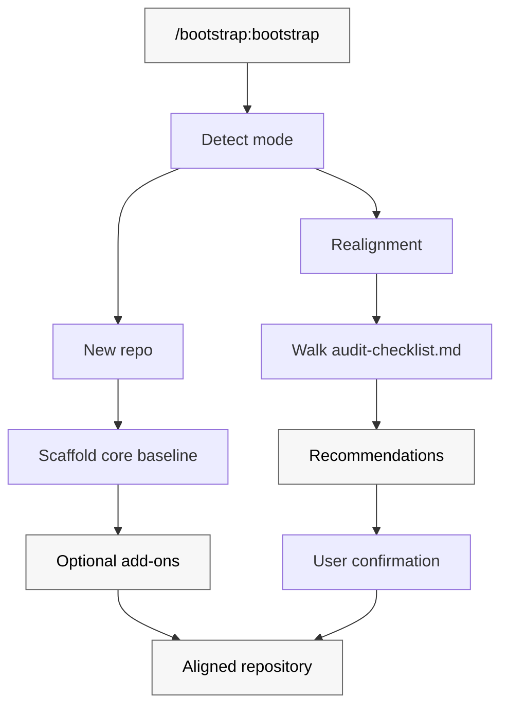

<!-- Source: patinaproject/bootstrap @v1.10.0 -->

# scaffold-repository

Scaffold a new repository – or realign an existing one – to the Patina Project baseline. One invocation, consistent conventions, portable across every major AI coding tool.

Bootstrap is a Claude Code + Codex plugin distributed through the [`patinaproject/skills`](https://github.com/patinaproject/skills) marketplace. It ships a single skill that scaffolds a complete Patina Project baseline repository (commit + PR conventions, PNPM + Husky + markdownlint, agent docs, plugin manifests, release flow, GitHub repo settings) and keeps existing repos aligned with the latest baseline on rerun.

## How bootstrap works

Bootstrap operates in one of two modes based on what it finds in the target repository.



## What bootstrap enforces

### Core baseline – every repo

- **Conventional Commits** with no scope and a required `#<issue>` tag; enforced locally by husky + commitlint and in CI by `pull-request.yml`.
- **PR title hygiene** – ASCII-only, conventional format, `#<issue>` subject, breaking-change marker consistency, `Closes #<issue>` in body.
- **Markdown linting** via `markdownlint-cli2`; husky `pre-commit` + `lint-staged` locally, `markdown.yml` in CI.
- **Workflow linting** via `actionlint` with `.github/actionlint.yaml`.
- **GitHub Actions SHA pinning** – every `uses:` references a full commit SHA with a version comment; policy documented in `AGENTS.md`.
- **PNPM toolchain** – `packageManager: pnpm@10.33.2`, `engines.node >=24`, `.nvmrc`, `.gitattributes`, `.editorconfig`.
- **Agent + repo docs** – `AGENTS.md`, `CLAUDE.md`, `CONTRIBUTING.md`, `SECURITY.md` (public only), `README.md`, `docs/file-structure.md`.
- **Claude Code project settings** – `.claude/settings.json` with `enabledPlugins` declaring Patina Project marketplace plugins.
- **CODEOWNERS + issue/PR templates** under `.github/`.

### AI agent plugin add-ons

When the repo is itself a plugin, bootstrap additionally emits manifests/config for every AI coding tool with a real plugin/extension model: Claude Code, Codex, GitHub Copilot, Cursor, Windsurf. Aider, Zed, Cline, Codex CLI, and Opencode are covered by the core `AGENTS.md`. Continue.dev is an opt-in secondary editor.

### Release flow

For plugins, bootstrap wires a complete [release-please](https://github.com/googleapis/release-please) flow – standing release PR, auto-generated `CHANGELOG.md` and GitHub Release notes, both plugin manifests kept in lockstep with `package.json` on every bump. When the repo is in the `patinaproject` org, the release workflow also dispatches a marketplace-bump event to `patinaproject/skills`.

### GitHub repository settings

Bootstrap walks the target repo's merge settings (via `gh api`, `curl`, or visual inspection) and walks the user through the GitHub UI with a deep-link to bring them into alignment. Full matrix in [SKILL.md](./skills/bootstrap/SKILL.md#github-repository-settings).

## Modes

- **New repo** – scaffold the full baseline, leave the first commit to the user.
- **Realignment** – walk the checklist, classify gaps as `missing`/`stale`/`divergent`, recommend changes grouped into ordered batches, never overwrite without explicit user confirmation.

## Supported AI coding tools

| Tool | Surface | Covered by |
|---|---|---|
| [Claude Code](#claude-code) | `.claude-plugin/plugin.json` | Plugin manifest |
| [OpenAI Codex CLI](#openai-codex-cli) | `.codex-plugin/plugin.json` | Plugin manifest |
| [OpenAI Codex App](#openai-codex-app) | `.codex-plugin/plugin.json` | Plugin manifest |
| [GitHub Copilot](#github-copilot) | `.github/copilot-instructions.md` | Instructions file |
| [Cursor](#cursor) | `.cursor/rules/<repo>.mdc` | Rule file |
| [Windsurf](#windsurf) | `.windsurfrules` | Rule file |
| [Aider](#aider) | `AGENTS.md` | Native |
| [Zed](#zed) | `AGENTS.md` | Native |
| [Cline](#cline) | `AGENTS.md` | Native |
| [Opencode](#opencode) | `AGENTS.md` | Native |
| [Continue.dev](#continuedev) | `.continue/config.json` | Opt-in |

## Installation

`scaffold-repository` ships as part of the `patinaproject/skills` bundle. See [../../../README.md](../../../README.md) for the full install guide.

```bash
npm_config_ignore_scripts=true npx skills@1.5.6 add patinaproject/skills --agent <agent> -y
```

Other supported editors read the repository-level files this skill emits (`AGENTS.md`, `.cursor/`, `.windsurfrules`, `.github/copilot-instructions.md`) directly – those tools require no additional plugin install. Pick the section for your tool.

### Claude Code

1. Register the Patina Project marketplace:

   ```text
   /plugin marketplace add patinaproject/skills
   ```

2. Install the plugin:

   ```text
   /plugin install patinaproject-skills@patinaproject-skills
   ```

3. Open the target repo in Claude Code (or a GitHub issue in the target repo) and invoke:

   ```text
   /scaffold-repository:scaffold-repository
   ```

### OpenAI Codex CLI

1. Register the Patina Project marketplace:

   ```bash
   codex plugin marketplace add patinaproject/skills
   ```

2. Install the plugin pinned to a tag (recommended):

   ```bash
   codex plugin marketplace add patinaproject/skills --ref <MARKETPLACE_TAG>
   ```

3. Open the target repo and invoke:

   ```text
   Use $scaffold-repository to scaffold or realign this repository.
   ```

### OpenAI Codex App

1. Install or enable the Bootstrap plugin from your Codex plugin source.
2. Open the target repo in the app.
3. Invoke:

   ```text
   Use $bootstrap to scaffold or realign this repository.
   ```

### GitHub Copilot

No plugin install required. Bootstrap-scaffolded repos ship `.github/copilot-instructions.md`, which Copilot Chat reads automatically when the repo is open in your editor.

1. Clone the bootstrap-scaffolded repo and open it.
2. Invoke Bootstrap from Copilot Chat:

   ```text
   @workspace Use the bootstrap skill to scaffold or realign this repository.
   ```

Personal Copilot preferences belong in your user-scoped Copilot settings, not in the emitted `.github/copilot-instructions.md`.

### Cursor

No plugin install required. Bootstrap emits `.cursor/rules/<repo>.mdc`, which Cursor loads as a project rule whenever the repo is open.

1. Clone the bootstrap-scaffolded repo and open it in Cursor.
2. Ask the Cursor agent to apply Bootstrap:

   ```text
   Use the bootstrap skill to scaffold or realign this repository.
   ```

Personal Cursor rules belong in your user-scoped Cursor settings, not in the emitted `.cursor/rules/`.

### Windsurf

No plugin install required. Bootstrap emits `.windsurfrules`, which Windsurf reads natively when the repo is open.

1. Clone the bootstrap-scaffolded repo and open it in Windsurf.
2. Ask Cascade to apply Bootstrap:

   ```text
   Use the bootstrap skill to scaffold or realign this repository.
   ```

### Aider

No plugin install required. Aider reads `AGENTS.md` natively.

1. Clone the bootstrap-scaffolded repo.
2. Run `aider` from inside the repo and ask it to apply the bootstrap workflow described in `AGENTS.md`.

### Zed

No plugin install required. Zed's assistant reads `AGENTS.md` natively.

1. Clone the bootstrap-scaffolded repo and open it in Zed.
2. Ask the assistant to apply the bootstrap workflow described in `AGENTS.md`.

### Cline

No plugin install required. Cline reads `AGENTS.md` natively when the repo is open in VS Code.

1. Clone the bootstrap-scaffolded repo and open it in VS Code with the Cline extension active.
2. Ask Cline to apply the bootstrap workflow described in `AGENTS.md`.

### Opencode

No plugin install required. Opencode reads `AGENTS.md` natively.

1. Clone the bootstrap-scaffolded repo and open it in Opencode.
2. Ask Opencode to apply the bootstrap workflow described in `AGENTS.md`.

### Continue.dev

Continue.dev support is opt-in. Add the following entry to your `.continue/config.json` (project-scoped or user-scoped) so Continue picks up the bootstrap context:

```jsonc
{
  "context": [
    {
      "provider": "file",
      "params": {
        "files": ["AGENTS.md", ".github/copilot-instructions.md"]
      }
    }
  ]
}
```

Then ask Continue to apply the bootstrap workflow described in `AGENTS.md`.

## First use

After installing, run bootstrap from a cloned repository. The skill will prompt for:

- `<owner>`, `<repo>`, `<repo-description>`
- `<visibility>` – public or private
- `<is-agent-plugin>` – yes emits plugin manifests + Cursor/Windsurf/Copilot surfaces
- `<use-superteam>` – yes emits `docs/superpowers/` skeleton
- Continue.dev – opt-in

Author name, author email, and `SECURITY.md` contact default from `git config user.name` / `git config user.email`.

## Development

This repository is its own reference implementation. Every file bootstrap emits is present either at the repo root or under `skills/bootstrap/templates/`. Running realignment mode against this repo must report zero gaps.

Local workflow:

```bash
pnpm install           # installs dev deps and wires husky
pnpm lint:md           # markdownlint-cli2
pnpm check:versions    # enforce package.json ↔ plugin manifests lockstep
pnpm commitlint        # one-off commit-message validation
```

Commits and PR titles follow the enforced convention: `type: #<issue> short description`. See [`CONTRIBUTING.md`](./CONTRIBUTING.md) for the full rule; choose the commit type by product impact, not by file extension.

| Change | Type |
|--------|------|
| Adds or changes shipped behavior, including behavior expressed in Markdown skill files, workflow gates, prompt contracts, plugin metadata, marketplace behavior, generated agent instructions, or other user-visible configuration | `feat:` |
| Corrects broken shipped behavior in those same product surfaces | `fix:` |
| Explains the product without changing shipped behavior or release semantics | `docs:` |
| Performs maintenance that does not alter user-facing behavior | `chore:` |

Edits to `skills/**/SKILL.md` and adjacent skill workflow contracts are product/runtime changes by default, not documentation edits. Changes that should produce a release must not use non-bumping types such as `docs:` or `chore:`.

## Contributing

See [`CONTRIBUTING.md`](./CONTRIBUTING.md) and [`AGENTS.md`](./AGENTS.md). The release flow lives in [`RELEASING.md`](./RELEASING.md).

## Related

- [`skills/bootstrap/SKILL.md`](./skills/bootstrap/SKILL.md) – skill contract, modes, placeholders, emitted tree.
- [`skills/bootstrap/audit-checklist.md`](./skills/bootstrap/audit-checklist.md) – realignment checklist.
- [`docs/file-structure.md`](./docs/file-structure.md) – layout reference.
- [`patinaproject/superteam`](https://github.com/patinaproject/superteam) – sibling plugin whose layout bootstrap enforces.
- [`patinaproject/skills`](https://github.com/patinaproject/skills) – marketplace distributing Patina Project plugins.
