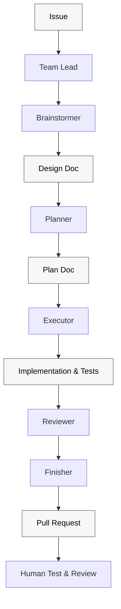
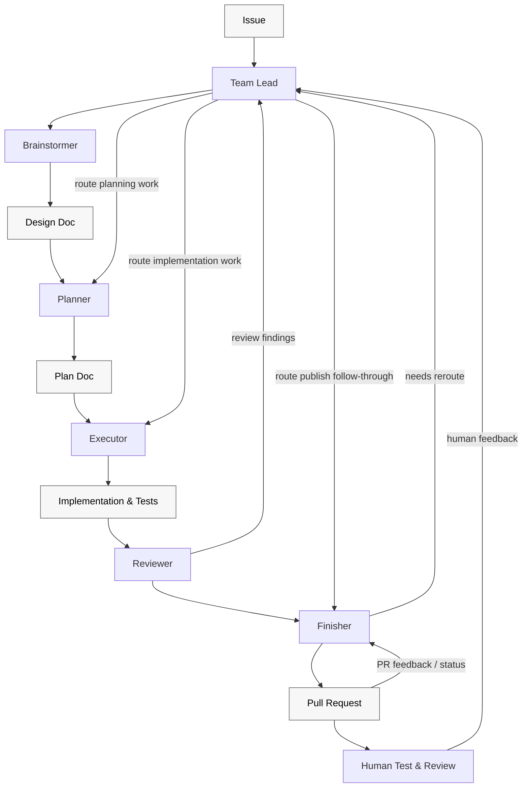

<!-- Source: patinaproject/superteam @v1.5.0 -->

# Superteam

Build with a team of agents using Superpowers.

`superteam` is a Claude Code + Codex plugin. It ships an installable orchestration skill under `skills/superteam/` and is distributed through the [`patinaproject/skills`](https://github.com/patinaproject/skills) marketplace.

Spend less time managing implementation loops and babysitting CI. Superteam builds on Superpowers to get you to a real, demoable, testable artifact as quickly as possible, with enough structure to review it, iterate on it, and keep moving.

## What this plugin does

Superteam takes one GitHub issue and routes it through a structured teammate workflow — `Team Lead`, `Brainstormer`, `Planner`, `Executor`, `Reviewer`, `Finisher` — so the next agent, subagent, or human can continue from durable artifacts (design doc, plan doc, branch, PR) instead of chat history alone.





The workflow stays portable across agent teams and direct subagent handoffs because it is organized around teammate ownership, repo-owned artifacts, and explicit gates rather than one host runtime's mechanics.

## What happens at each stage

- `Team Lead`: reads the issue, discovers repo rules, decides which teammate should act next, and halts the run when a gate is not satisfied.
- `Brainstormer`: turns the issue into a design doc, captures the active acceptance criteria, and asks for explicit approval before planning starts.
- `Planner`: converts the approved design into an implementation plan with concrete tasks.
- `Executor`: implements only the approved plan, including tests and verification evidence. Does not push branches or open PRs.
- `Reviewer`: performs local pre-publish review, classifies findings as implementation-, plan-, or spec-level, and pressure-tests skill/workflow changes before publish.
- `Finisher`: pushes, opens or updates the PR, monitors CI and mergeability, interprets external PR feedback, and keeps the run alive until the published branch state is stable.

A run is only complete when the published branch state is stable enough to hand off cleanly or an explicit blocker is reported.

## Agent roster

| Teammate | Owns | Recommended `superpowers` skills |
| --- | --- | --- |
| Team Lead | Orchestration, delegation, gates, and loopbacks | `superpowers:using-superpowers`; `superpowers:dispatching-parallel-agents` when splitting independent work |
| Brainstormer | Design doc creation and approval handoff | `superpowers:brainstorming` |
| Planner | Approved implementation plan creation | `superpowers:writing-plans` |
| Executor | ATDD-driven implementation, code, and tests for the approved plan | `superpowers:test-driven-development`; `superpowers:systematic-debugging`; `superpowers:verification-before-completion`; `superpowers:writing-skills` when editing `skills/**/*.md` |
| Reviewer | Local pre-publish review intake, finding classification, loopback routing | `superpowers:requesting-code-review`; `superpowers:receiving-code-review`; `superpowers:writing-skills` when reviewing `skills/**/*.md` |
| Finisher | Publish-state follow-through, branch/PR/CI reporting, external post-publish review feedback | `superpowers:finishing-a-development-branch`; `superpowers:receiving-code-review` |

## Install

Install just this skill via the [vercel-labs/skills](https://github.com/vercel-labs/skills) CLI:

```bash
npx skills@latest add patinaproject/skills --skill superteam
```

Or install the full `patinaproject-skills` plugin via your host's marketplace:

- Claude Code: `/plugin marketplace add patinaproject/skills` then `/plugin install patinaproject-skills@patinaproject-skills`
- Codex: `/marketplace add patinaproject/skills` then `/install patinaproject-skills`

See the [root README](../../README.md) for the full install guide.

## Usage

```text
/superteam:superteam work on issue 16
/superteam:superteam new requirement: make it more super
/superteam:superteam resume from review
```

Superteam keeps the workflow grounded in explicit teammate ownership, written design and plan artifacts, verification before completion, and finish-owned review follow-through. You can invoke Superteam at any point in the lifecycle and have it resume from the right teammate instead of starting over.

For GitHub Actions or other headless one-shot runs, use
`/superteam-non-interactive`. It ships with this plugin and preserves the same
teammate contracts while failing fast whenever an interactive prompt would have
been required.

## Development

This repository is the source for the plugin. Local workflow:

```bash
pnpm install           # installs dev deps and wires husky
pnpm lint:md           # markdownlint-cli2
pnpm check:versions    # enforce package.json ↔ plugin manifests lockstep
pnpm commitlint        # one-off commit-message validation
```

Commits and PR titles follow `type: #<issue> short description`. See
[`CONTRIBUTING.md`](./CONTRIBUTING.md) for the full rule; choose the commit type
by product impact, not by file extension.

| Change | Type |
|--------|------|
| Adds or changes shipped behavior, including behavior expressed in Markdown skill files, workflow gates, prompt contracts, plugin metadata, marketplace behavior, generated agent instructions, or other user-visible configuration | `feat:` |
| Corrects broken shipped behavior in those same product surfaces | `fix:` |
| Explains the product without changing shipped behavior or release semantics | `docs:` |
| Performs maintenance that does not alter user-facing behavior | `chore:` |

Edits to `skills/**/SKILL.md` and adjacent skill workflow contracts are product/runtime changes by default, not documentation edits. Changes that should produce a release must not use non-bumping types such as `docs:` or `chore:`.

Releases are driven by [release-please](https://github.com/googleapis/release-please) — merge the standing release PR to cut a new `vX.Y.Z`. See [`RELEASING.md`](./RELEASING.md).

## Contributing

See [`CONTRIBUTING.md`](./CONTRIBUTING.md) and [`AGENTS.md`](./AGENTS.md).

## Inspiration

- BMAD-Method: Grateful to BMAD for introducing us to agentic frameworks; our earlier quick-dev and TEA experiments helped shape this workflow.
- Superpowers: Foundational skills framework that brought this to life.
- Ken Kocienda's *Creative Selection*: Importance of demo culture.

## Related

- [`skills/superteam/SKILL.md`](./SKILL.md) — skill contract.
- [`patinaproject/skills`](https://github.com/patinaproject/skills) — marketplace distributing Patina Project plugins.
- [`patinaproject/bootstrap`](https://github.com/patinaproject/bootstrap) — scaffolding skill that emitted this repo's baseline.
